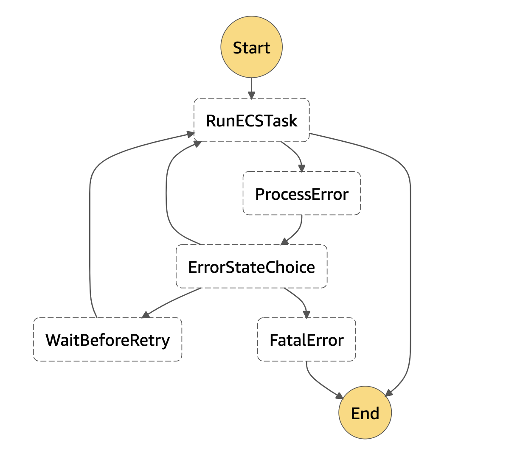

# AWS step functions runTask retry

A demo project that shows how to implement complex retry logic using the ECS runTask api in a step function.

## Scope of this project

AWS Step Functions allows you to [run an ECS or FARGATE task](https://docs.aws.amazon.com/step-functions/latest/dg/connect-ecs.html) as a step of your state machine. The step function runs your task using the [ECS runTask api](https://docs.aws.amazon.com/AmazonECS/latest/APIReference/API_RunTask.html) and waits until one of the "essential" containers exits. When your task stops because of an error, you can use the [retry feature](https://docs.aws.amazon.com/step-functions/latest/dg/concepts-error-handling.html#error-handling-retrying-after-an-error) of step functions to rerun your task. But you most likely want to adopt different retry strategy based on the type of error, for example if it's a fatal error the task should not be re-executed. Though unlike lambdas, where you can access the type of error and [customize your retry strategy](https://aws.amazon.com/blogs/compute/automating-aws-lambda-function-error-handling-with-aws-step-functions/) based on that, with ECS tasks the error type is always `States.TaskFailed`. The only way to understand why the task failed is to parse the `Cause` field of the step output and get the container exit code, but that's not possible by simply using the step functions state language. This project shows how you can parse the error returned by the state machine and customize your retry strategy based on that.

## How it works

The custom retry mechanism relies on the fact that the application running in the container returns a proper exit code based on the type of error occurred. When the task fails we catch the error and we send the output to the `ProcessError` step.

```json
"Catch": [
    {
        "ErrorEquals": [
            "States.ALL"
        ],
        "ResultPath": "$.taskError",
        "Next": "ProcessError"
    }
]
```

The `ProcessError` step is a simple lambda function that will parse the output (which contains the error cause and the exit code) and returns an `errorState` as part of the output. This is an example of the output:

```json
"errorState": {
  "type": "RETRIABLE",
  "retryCount": 1,
  "waitSeconds": 60
}
```

Every time the lambda processes an error output, it increases the retries count. When the maximum number of retries is reached, the lambda will return a `FATAL` error type.

The next step uses the `Choice` state to decide what's the next step based on the error state type returned.

```json
"ErrorStateChoice": {
    "Type": "Choice",
    "Choices": [
        {
            "Variable": "$.errorState.type",
            "StringEquals": "RETRIABLE",
            "Next": "RunECSTask"
        },
        {
          "Variable": "$.errorState.type",
            "StringEquals": "TEMPORARY",
            "Next": "WaitBeforeRetry"
        },
        {
          "Variable": "$.errorState.type",
            "StringEquals": "FATAL",
            "Next": "FatalError"
        }
    ]
}
```

- `RETRIABLE`: immediately try to rerun the ECS task
- `TEMPORARY`: wait before rerun the task. The next step will be `WaitBeforeRetry` which is a `Wait` state, the number of seconds to wait is returned as part of the previous step output.
- `FATAL`: cause the step function failure (exits immediately). The next step will be `FatalError` which is a `Fail` state.

The full definition of the state machine can be found [here](./state-machine.json).



## Test the step function

The state machine expects as an input the name of one of the app errors defined [here](./src/app/errors.js). The error name will be passed to the app task and will cause the container to exit with the correspondent exit code.

Open the step function page in the AWS console and click on `Start Execution`. In the input section add something like this:

```json
{
    "commands": [
      "NetworkError"
    ]
}
```

## Development

### Publish docker image to AWS ECR

Prerequisites:
  - Your docker client is authenticated to your AWS ECR registry
  - AWS credentials, `AWS_REGION` and `AWS_ACCOUNT_ID` exported as environment variables.

To build and publish the docker image to AWS ECR run:

    npm run docker:publish

#### Build and run locally

    npm run docker:build && npm run docker:run

### Deploy

The project uses the [serverless framework](https://serverless.com/) and the [step functions plugin](https://serverless.com/plugins/serverless-step-functions/).

To deploy the project just run:

    serverless deploy --subnetId <SUBNET-ID>

The `subnetId` parameter specifies in which subnet the fargate task will run.
